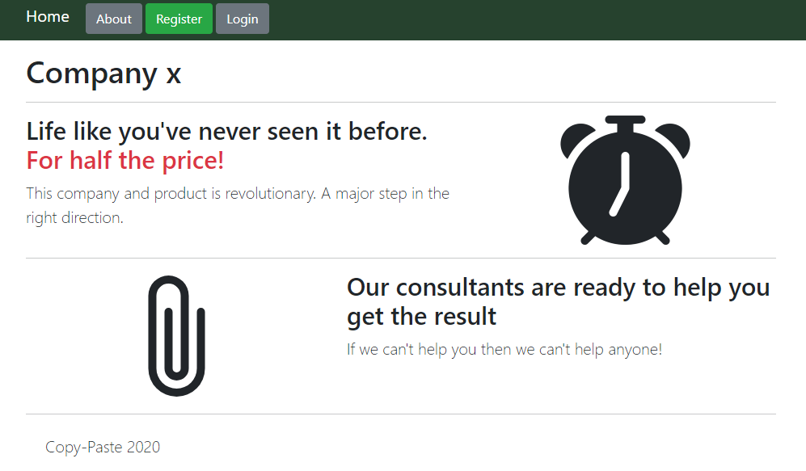

# Tech Support (Web)

## Introduction

This challenge comes with the following instructions:

> Try chatting with tech support about getting a flag.

> Note: We have received multiple reports of exploits not working remotely, but we triple checked and concluded that the bot is working properly.

> https://typeselfsub.web.ctfcompetition.com/

This URL leads to a website for "Company x":




We must regiter to continue:


After logging in, two new URLs are available in the main menu.
https://typeselfsub.web.ctfcompetition.com/flag:


And https://typeselfsub.web.ctfcompetition.com/chat, where we can send chat messages.


The goal of this challenge is to perform an XSS attack on the chat user we are messaging in order to exfiltrate the flag.


## Observations

We will iniate the chat with this message and use [PTS](https://ptsv2.com/) to observe network requests.

```html

```

Note that "+" has to be encoded as "%2b". We can see that the chat user is currently at `https://typeselfsub-support.web.ctfcompetition.com/static/chat.html`.


We observe that the following pages are located on different subdomains:

* https://typeselfsub.web.ctfcompetition.com/flag
* https://typeselfsub-support.web.ctfcompetition.com/static/chat.html


Due to CORS restrictions, it is not possible to simply have the chat user fech the flag and to pass it to us.


## Exfiltration

Through trial and error, we find the solution in a different approach:

```html

```


Note that the different parameters in the image are actually part of the [referrer](https://developer.mozilla.org/en-US/docs/Web/API/Document/referrer). Stitching it back together, we get this URL: https://typeselfsub.web.ctfcompetition.com/asofdiyboxzdfasdfyryryryccc?username=mike&password=j9as7ya7a3636ncvx&reason=

We are now logged in as Mike and can grab the flag:


Flag: `CTF{self-xss?-that-isn't-a-problem-right...}`
